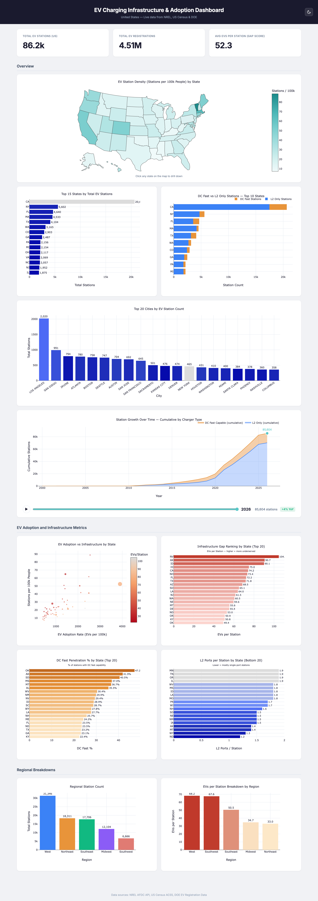
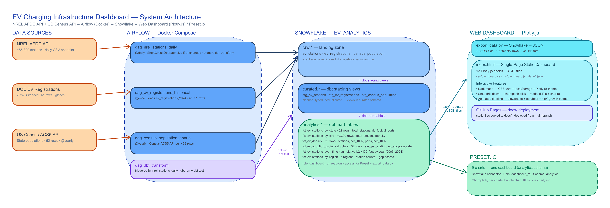

# EV Charging Infrastructure & Adoption Dashboard

An end-to-end data engineering pipeline that ingests real US EV charging station data, transforms it through a layered warehouse, and surfaces insights on a live analytics dashboard.

**Stack**: NREL AFDC API + US Census API → Airflow (Docker) → Snowflake → dbt → Web Dashboard (Plotly.js) / Preset.io

---

## Dashboard Preview



---

## Dashboard Insights

- EV station density by state (stations per 100k people)
- Volume ranking — top 15 states and top 20 cities by station count
- DC fast vs L2-only station breakdown
- Infrastructure gap ranking — which states have the most EVs per charging station
- EV adoption rate vs infrastructure density scatter
- Station growth over time — cumulative L2 vs DC fast by year (2005–2024)
- DC fast penetration rate by state — % of stations with fast-charging capability
- L2 ports per station by state — hub-style vs single-port network design patterns
- Regional breakdown — station counts and gap scores across 5 US regions

### Interactive Features (v3)

- **Dark mode toggle** — persistent theme switcher (light/dark) with smooth transitions across all charts and UI
- **State drill-down modal** — click any state on the choropleth map to see KPIs, top cities bar chart, and charger type donut breakdown
- **Animated timeline** — progressive-reveal animation on the growth chart with play/pause, scrubber, and YoY growth rate badge

---

## Architecture



```
Data Sources
├── NREL AFDC API          → ~85,800 US EV stations (daily, live)
├── DOE EV Registrations   → 2024 state-level EV counts (manual CSV seed)
└── US Census ACS5 API     → State populations (annual)

Airflow (Docker Compose)
├── dag_nrel_stations_daily          @daily   — full snapshot with skip-if-unchanged check
├── dag_ev_registrations_historical  @once    — loads data/ev_registrations_2024.csv
├── dag_census_population_annual     @yearly  — Census ACS5 API pull
└── dag_dbt_transform                triggered — runs dbt run + dbt test after ingest

Snowflake (EV_ANALYTICS database)
├── raw.*           — landing zone, exact source replica
├── curated.*       — dbt staging views (cleaned, typed, deduplicated)
└── analytics.*     — dbt mart tables (aggregated, dashboard-ready)

Web Dashboard (v3)
├── export_data.py     — Snowflake → JSON export (~9,300 city rows, ~340KB)
├── index.html         — single-page static dashboard (12 Plotly.js charts)
├── Dark mode          — CSS variables + localStorage, Plotly re-theming via JS
├── State drill-down   — choropleth click → modal with KPIs + city chart + donut
├── Animated timeline  — progressive-reveal growth chart with play/pause + YoY badge
└── docs/              — GitHub Pages deployment folder

Preset.io (v1)
└── 9 charts assembled into one dashboard (connected to analytics schema via dashboard_ro role)
```

---

## Project Structure

```
ev-charging-stations-dashboard/
├── airflow/
│   ├── Dockerfile
│   ├── requirements.txt
│   ├── docker-compose.yml
│   └── dags/
│       ├── dag_nrel_stations_daily.py
│       ├── dag_ev_registrations_historical.py
│       ├── dag_census_population_annual.py
│       └── dag_dbt_transform.py
├── dbt/
│   ├── dbt_project.yml
│   ├── profiles.yml
│   ├── macros/
│   │   └── generate_schema_name.sql
│   ├── models/
│   │   ├── sources.yml
│   │   ├── staging/
│   │   │   ├── stg_ev_stations.sql
│   │   │   ├── stg_ev_registrations.sql
│   │   │   └── stg_census_population.sql
│   │   └── marts/
│   │       ├── fct_ev_stations_by_state.sql
│   │       ├── fct_ev_stations_by_city.sql
│   │       ├── fct_ev_density.sql
│   │       ├── fct_ev_adoption_vs_infrastructure.sql
│   │       ├── fct_ev_stations_over_time.sql
│   │       └── fct_ev_stations_by_region.sql
│   └── seeds/
│       └── dim_geography.csv
├── data/
│   └── ev_registrations_2024.csv
├── sql/
│   └── snowflake_setup.sql
├── web_dashboard/                          # v3 — static web frontend
│   ├── export_data.py                      # Snowflake → JSON exporter
│   ├── index.html                          # Single-page dashboard
│   ├── css/dashboard.css                   # Theming (CSS variables, dark mode, modal, timeline)
│   ├── js/dashboard.js                     # 12 charts + dark mode + drill-down modal + timeline animation
│   └── data/                               # Exported JSON files (~340KB)
│       ├── kpis.json
│       ├── stations_by_state.json
│       ├── stations_by_city.json
│       ├── ev_density.json
│       ├── adoption_vs_infrastructure.json
│       ├── stations_by_region.json
│       └── stations_over_time.json
├── docs/                                   # GitHub Pages deployment (copy of web_dashboard static files)
├── mock_dashboard/                         # Local Streamlit preview (simulated data)
│   ├── app.py
│   └── mock_data.py
└── agent_outputs/
    ├── PLAN.md
    ├── PLAN_dashboard_v3_enhancements.md
    ├── implementation_summary.md
    ├── chart_recommendations.md
    └── web_dashboard/
        ├── PLAN_web_dashboard.md
        └── implementation_summary_web_dashboard.md
```

---

## Setup

### Prerequisites
- Docker Desktop running
- Snowflake account (free trial works)
- NREL API key (free at developer.nrel.gov)
- Preset.io account (free tier works)

### 1. Configure environment variables

Copy `.env.example` to `.env` and fill in your credentials:

```
SNOWFLAKE_ACCOUNT=<org>-<account>      # e.g. TVYQNZR-ABC12345 — no region suffix
SNOWFLAKE_USER=<username>
SNOWFLAKE_PASSWORD=<password>
SNOWFLAKE_DATABASE=EV_ANALYTICS
SNOWFLAKE_WAREHOUSE=COMPUTE_WH
SNOWFLAKE_ROLE=ACCOUNTADMIN
NREL_API_KEY=<your_key>
AIRFLOW_UID=50000
```

### 2. Run Snowflake setup

In Snowflake worksheet, run all statements in `sql/snowflake_setup.sql` (use **Run All**).

This creates the database, 3 schemas, raw tables, and the `dashboard_ro` read-only role.

### 3. Start Airflow

```bash
cd airflow
docker compose up --build
```

Wait ~60 seconds, then open http://localhost:8080 (admin / admin).

### 4. Run the DAGs

In Airflow UI, run in this order:
1. `ev_registrations_historical` — one-time load from CSV
2. `census_population_annual` — one-time Census API pull
3. `nrel_stations_daily` — full station snapshot (~85k rows, ~5 min)
4. `dbt_transform` — triggered automatically after step 3, or run manually

### 5. Connect Preset.io

Create a Snowflake connection in Preset with:
- **Account**: your Snowflake account identifier (org-account format)
- **Database**: `EV_ANALYTICS`
- **Schema**: `analytics`
- **Warehouse**: `COMPUTE_WH`
- **Role**: `dashboard_ro`

Add datasets: `fct_ev_stations_by_state`, `fct_ev_stations_by_city`, `fct_ev_density`, `fct_ev_adoption_vs_infrastructure`, `fct_ev_stations_over_time`, `fct_ev_stations_by_region`

---

## Web Dashboard (v3) — Static Frontend

A standalone HTML/Plotly.js dashboard with dark mode, state drill-down modal, and animated timeline. No backend server needed at runtime — all data is pre-exported as JSON from Snowflake.

### Export data and test locally

```bash
# Export Snowflake analytics tables to JSON (requires .env with Snowflake credentials)
cd web_dashboard
python export_data.py

# Serve locally (fetch() requires HTTP, won't work from file://)
python -m http.server 8000
# Open http://localhost:8000
```

### Deploy to GitHub Pages

The `docs/` folder is a copy of the static site files, ready for GitHub Pages:

1. Copy latest files: `cp index.html ../docs/ && cp -r css js data ../docs/`
2. Push to `main`
3. In repo **Settings → Pages**, set Source to **Deploy from branch** → `main` / `/docs`

Live URL: `https://singhpriyanshu5.github.io/us-ev-charging-stations-dashboard/`

### Refresh dashboard data

```bash
cd dbt && dbt run --target prod       # refresh analytics tables
cd ../web_dashboard && python export_data.py  # re-export JSON
cp index.html ../docs/ && cp -r css js data ../docs/
cd .. && git add docs/ web_dashboard/data/ && git commit -m "refresh dashboard data" && git push
```

---

## Mock Dashboard (local preview)

A Streamlit mock dashboard with simulated data is available for layout preview:

```bash
cd mock_dashboard
pip install streamlit plotly pandas
streamlit run app.py
```

Opens at http://localhost:8501

---

## Key Data Notes

- **NREL API**: The JSON endpoint caps at 200 records and ignores pagination params. The pipeline uses the CSV endpoint (`/v1.csv`) which returns all ~85k stations in one request.
- **EV Registrations**: AFDC has no programmatic API. The 2024 data was manually sourced and saved to `data/ev_registrations_2024.csv`. Annual refresh requires manually updating this file.
- **DC fast station count**: `ev_dc_fast_num` is null for ~82% of stations. The pipeline derives DC fast presence from `ev_connector_types` (99.98% complete) instead — see `stg_ev_stations.sql`. As a result, `total_dc_fast_ports` in the marts undercounts by ~35% of DC fast stations and should be treated as approximate; use `stations_with_dc_fast` for station-count metrics.
- **Preset choropleth**: The ISO 3166-2 field requires full state codes in `US-XX` format. Use Custom SQL `CONCAT('US-', STATE)` rather than the bare `STATE` column.
